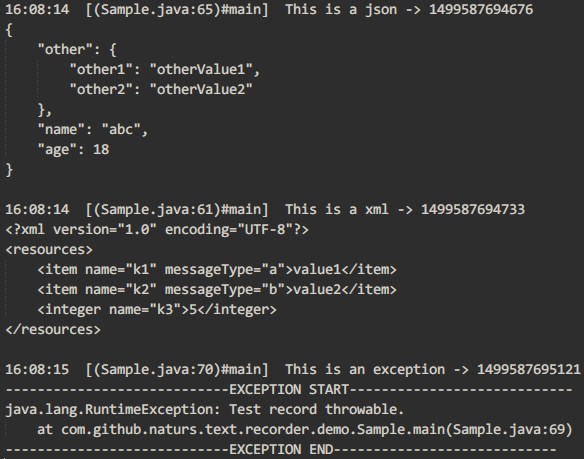
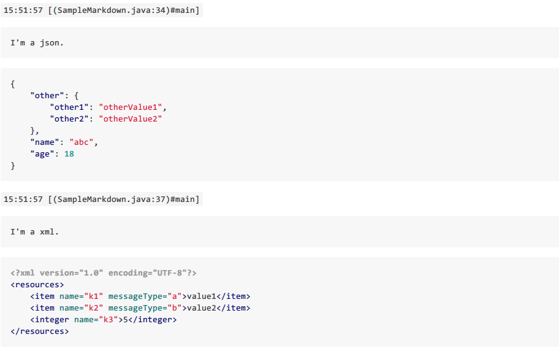

# TextRecorder #

一个文本记录工具，不限定文本具体格式，也不限定文本处理方式，比如你可以将普通文本、异常信息等记录在本地文件中。

## 效果 ##

使用项目提供的默认记录方式效果如下：



使用项目提供的markdown记录方式效果如下：



## 用法 ##

### 1. 添加引用 ###

### 2. 初始化 ###

`TextRecorder`需要添加默认配置，以便后续调用。

初始化方式如下：

```java
TextRecorder.init(
		Scheduler,
        TextLineConverter.Factory,
        TextLineProcessor.Factory,
        LogPrinter
);
```

其中参数含义如下：

- `Scheduler`，代表处理文本的线程，默认可使用`Schedulers.io()`；
- `TextLineConverter.Factory`，代表将文本对象`TextLine`转换成最终处理的字符串的转换器的工厂对象，你可以通过该工厂你可以将文本对象转换成任何你需要的文本字符串；
- `TextLineProcessor.Factory`，代表最终处理文本对象内容的处理器的工厂对象，一般来说，它会处理`TextLineConverter`转换后的数据，你可以通过该工厂以任意方式来处理你的文本内容，比如记录到本地文件中；
- `LogPrinter`，打印日志的接口，可根据运行环境来配置，比如Android下使用`android.util.Log`来打印日志；

### 3. 使用 ###

#### 3.1 默认方式 ####

项目中提供了`GenericTextLine`类作为处理文本记录的默认类，该类可记录以下文本内容：

- 普通文本；
- JSON；
- XML；
- 异常信息；
- 分割线（为了使最终文本内容更易阅读）；
- 空行（为了使最终文本内容更易阅读）；

**`TextRecorder`默认使用`GenericTextLine`来记录文本内容。**

```java
// 参数tag代表日志标签，最终会在Converter或Processor中用到
TextRecorder recorder = TextRecorder.with("module");
// 每一个append都是一条记录，可同时记录多条
recorder.append(String)
		.append(Throwable)
		.appendJson(JSON)
		.appendXml(XML)
		.appendBlankLine()
		.appendDivider();
// 同步提交
recorder.commit();
// OR 异步提交
recorder.apply();
```

#### 3.2 自定义方式 ####

部分情况下，默认记录方式可能不适合实际情况，可按下面步骤实现自定义记录方式。

1. 实现自定义的`TextLine`；
2. 实现自定义的`TextLineConverter`及`TextLineConverter.Factory`；
3. 实现自定义的`TextLineProcessor`及`TextLineProcessor.Factory`；
4. 使用自定义的`TextLineConverter.Factory`和`TextLineProcessor.Factory`初始化`TextRecorder`，并用自定义`TextLine`进行文本记录；

## License ##

	Copyright 2017 naturs

	Licensed under the Apache License, Version 2.0 (the "License");
	you may not use this file except in compliance with the License.
	You may obtain a copy of the License at

	http://www.apache.org/licenses/LICENSE-2.0

	Unless required by applicable law or agreed to in writing, software
	distributed under the License is distributed on an "AS IS" BASIS,
	WITHOUT WARRANTIES OR CONDITIONS OF ANY KIND, either express or implied.
	See the License for the specific language governing permissions and
	limitations under the License.